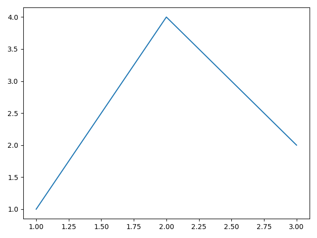
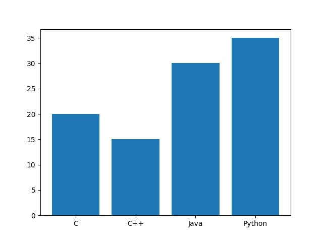
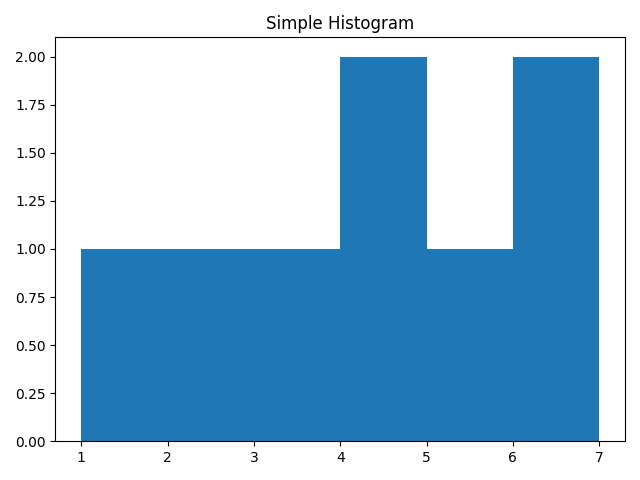
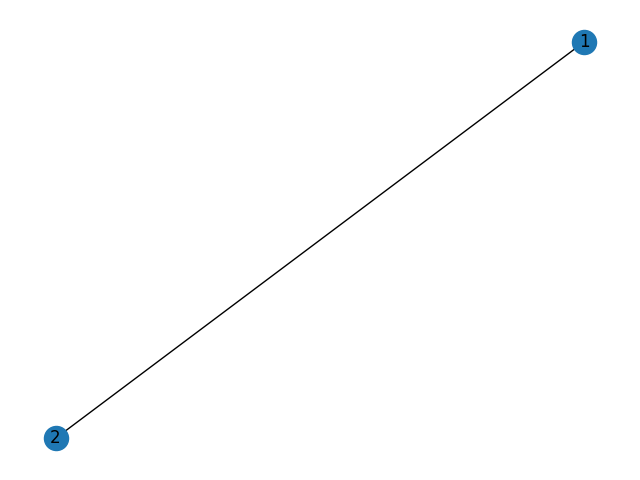

# PyPlot_cpp

### This is work in progress. May be unstable or not work

Simple library for displaying plots and graphs in c++

## Content table
- [PyPlot_cpp](#pyplot_cpp)
  - [Requirements](#requirements)
  - [Building](#building)
  - [Usage](#usage)


## Requirements

Firstly, with python script generation, you need to have python and matplotlib installed on your machine.
This library uses your system installed python, not venv.

Secondly, for test building you need Boost unit_test_framework.

## Building

This library builds with cmake. For testing you also need to install Boost with unit_test_framework.

## Usage

### 2D plot

To display simplest plot you need to code this.
```c++
#include "pyplot_cpp/Plot.hpp"

int main() {
    pyplot_cpp::Plot plot;
    plot.addPoint(1, 1);
    plot.addPoint(2, 4);
    plot.addPoint(3, 2);
    plot.show();
}
```
This will show you the simplest graph.

<!--suppress HtmlRequiredAltAttribute, HtmlRequiredAltAttribute, CheckImageSize -->eckImageSize -->


If you want to learn [Advanced usage of Plots](examples/AdvancedPlot.md) click here.

### Bar

To display bar you need to write this:
```c++
#include "pyplot_cpp/Bar.h"

int main() {
    pyplot_cpp::Bar bar;
    bar.appendData("C", 20);
    bar.appendData("C++", 15);
    bar.appendData("Java", 30);
    bar.appendData("Python", 35);
    bar.show();
}
```
This will show you your bar plot:



### Histogram

If you want to display histogram you need to use Histogram class.
```c++
#include "pyplot_cpp/Histogram.hpp"

int main() {
    pyplot_cpp::Histogram hist;
    hist.setData({1, 2, 3, 4, 5, 6, 7, 4});
    hist.setBins({1, 2, 3, 4, 5, 6, 7});
    hist.setTitle("Simple Histogram");
    hist.show();
}
```



To draw multiple histograms you need to use [Multiple Histogram](./examples/AdvancedPlot.md#multiple-histogram)

## Graphs

### Not-directional graph

Graphs working by networkx library, that working on matplotlib. This library also support to draw graphs.
```c++
#include "pyplot_cpp/Graph.hpp"

int main() {
    pyplot_cpp::Graph graph;
    graph.addEdge("1", "2");

    graph.setTitle("Simple Graph");
    graph.show();
}
```


Also you can draw directional graphs and etc. For more information check [this](examples/AdvancedGraph.md).