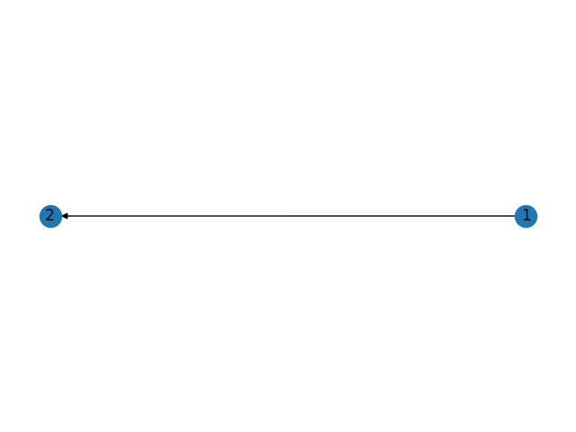

# Advanced usage of Graphs

## Directional graph

To draw directional Graph you need to use different kind of graph: DiGraph.
```c++
#include "pyplot_cpp/DiGraph.hpp"

int main() {
    pyplot_cpp::DiGraph graph;
    graph.addEdge("1", "2");

    graph.setTitle("Simple DiGraph");
    graph.show();
}
```


## Graph properties

### Edge weight
To set edge weight you need to 