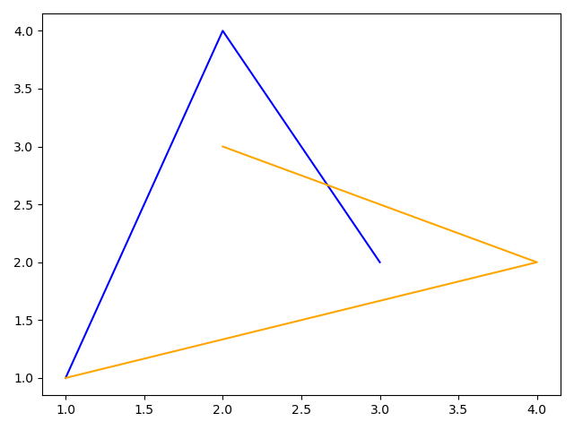
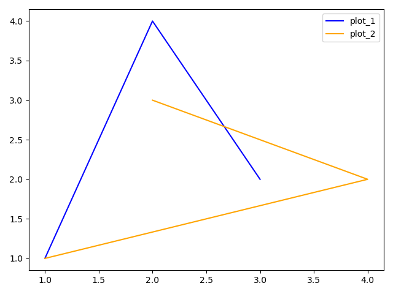

# Advanced usage of Plots

---

## Multiple Plot

MultiplePlot is a graph that can contain more than one graph. It can be displayed using the following code:
```c++
#include "pyplot_cpp/MultiplePlot.hpp"

int main() {
    pyplot_cpp::MultiplePlot multPlot;
    pyplot_cpp::Plot plot1;
    plot1.addPoint(1, 1);
    plot1.addPoint(2, 4);
    plot1.addPoint(3, 2);
    plot1.setColor(pyplot_cpp::plt::Color::BLUE);

    pyplot_cpp::Plot plot2;
    plot2.addPoint(1, 1);
    plot2.addPoint(4, 2);
    plot2.addPoint(2, 3);
    plot2.setColor(pyplot_cpp::plt::Color::ORANGE);

    multPlot.addPlot(plot1);
    multPlot.addPlot(plot2);

    multPlot.show();    
}
```


If you want to add a legend to your graph, you need to write the following
```c++
//    multPlot.addPlot(plot1);
multPlot.addPlot(plot1, "plot_1");
```

