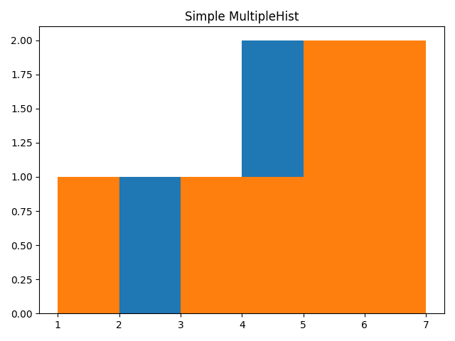

# Advanced usage of Plots

## Multiple Plot

MultiplePlot is a graph that can contain more than one graph. It can be displayed using the following code:
```c++
#include "pyplot_cpp/MultiplePlot.hpp"

int main() {
    pyplot_cpp::MultiplePlot multPlot;
    pyplot_cpp::Plot plot1;
    plot1.addPoint(1, 1);
    plot1.addPoint(2, 4);
    plot1.addPoint(3, 2);
    plot1.setColor(pyplot_cpp::plt::Color::BLUE);

    pyplot_cpp::Plot plot2;
    plot2.addPoint(1, 1);
    plot2.addPoint(4, 2);
    plot2.addPoint(2, 3);
    plot2.setColor(pyplot_cpp::plt::Color::ORANGE);

    multPlot.addPlot(plot1);
    multPlot.addPlot(plot2);

    multPlot.show();    
}
```
<!--suppress HtmlRequiredAltAttribute, HtmlRequiredAltAttribute -->


If you want to add a legend to your graph, you need to write the following
```c++
//    multPlot.addPlot(plot1);
multPlot.addPlot(plot1, "plot_1");
```


## Multiple Histogram

MultipleHistogram is a graph that can contain more than one histogram. It can be displayed using the following code:
```c++
#include "pyplot_cpp/MultipleHistogram.hpp"

int main() {
    pyplot_cpp::MultipleHistogram multHist;
    pyplot_cpp::Histogram hist1;
    hist1.setData({1, 2, 3, 4, 5, 6, 7, 4});
    hist1.setBins({1, 2, 3, 4, 5, 6, 7});

    pyplot_cpp::Histogram hist2;
    hist2.setData({5, 4, 3, 5, 6, 7, 1});
    hist2.setBins({1, 2, 3, 4, 5, 6, 7});


    multHist.addHist(hist1);
    multHist.addHist(hist2);
    multHist.setTitle("Simple MultipleHist");
    multHist.show();
}
```


It also can be modified by predefined properties or by addProperty function, that allow you to use any property, that is 
accepted by plt.hist function.